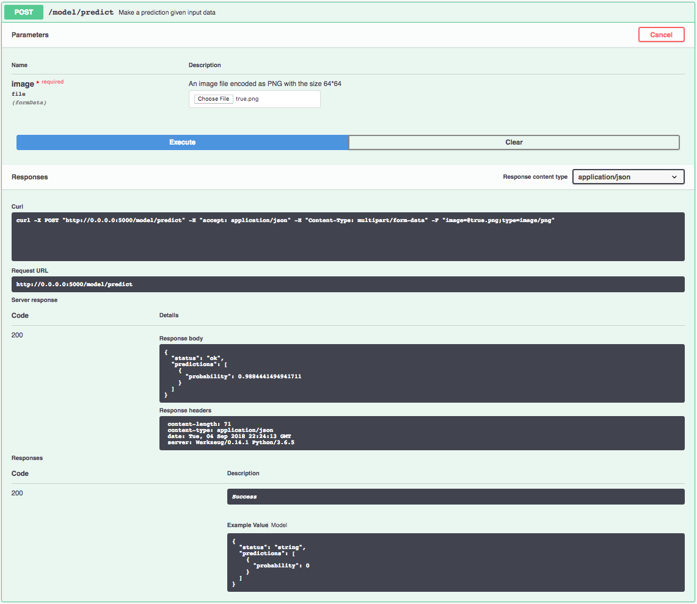

[](https://travis-ci.org/IBM/MAX-Breast-Cancer-Mitosis-Detector) [](http://max-breast-cancer-mitosis-detector.max.us-south.containers.appdomain.cloud/)

[](http://ibm.biz/max-to-ibm-cloud-tutorial)

# IBM Code Model Asset Exchange: Breast Cancer Mitosis Detector

The [Tumor Proliferation Assessment Challenge 2016 (TUPAC16)](http://tupac.tue-image.nl/) was created to develop state-of-the-art algorithms for automatic prediction of tumor proliferation scores from whole-slide histopathology images of breast tumors. The [IBM CODAIT](http://codait.org) team trained a mitosis detection model (a modified ResNet-50 model) on the [TUPAC16 auxiliary mitosis dataset](http://tupac.tue-image.nl/node/3), and then applied it to the whole slide images for predicting the tumor proliferation scores.

This repository contains code to instantiate and deploy the mitosis detection model mentioned above. This model takes a 64 x 64 PNG image file extracted from the whole slide image as input, and outputs the predicted probability of the image containing mitosis. For more information and additional features, check out the [deep-histopath](https://github.com/CODAIT/deep-histopath) repository on GitHub.

The code in this repository deploys the model as a web service in a Docker container. This repository was developed as part of the [IBM Code Model Asset Exchange](https://developer.ibm.com/code/exchanges/models/).

## Model Metadata
| Domain | Application | Industry  | Framework | Training Data | Input Data Format |
| ------------- | --------  | -------- | --------- | --------- | -------------- | 
| Vision | Cancer Classification | Health care | Keras | [TUPAC16](http://tupac.tue-image.nl/node/5) | 64x64 PNG Image|

_Note:_ Although this model supports different input data formats, the inference results are sensitive to the input data. In order to keep the extracted images the same as the original datasets, PNG image format should be used.


## References
* _Dusenberry, Mike, and Hu, Fei_, [Deep Learning for Breast Cancer Mitosis Detection](https://github.com/CODAIT/deep-histopath/raw/master/docs/tupac16-paper/paper.pdf), 2018.

## Licenses

| Component | License | Link  |
| ------------- | --------  | -------- |
| This repository | [Apache 2.0](https://www.apache.org/licenses/LICENSE-2.0) | [LICENSE](LICENSE) |
| Training Data | Custom License | [TUPAC16](http://tupac.tue-image.nl/node/5) |
| Test Samples | Custom License | [Sample README](samples/README.md) |

## Pre-requisites:

* `docker`: The [Docker](https://www.docker.com/) command-line interface. Follow the
[installation instructions](https://docs.docker.com/install/) for your system.
* The minimum recommended resources for this model is 2GB Memory and 2 CPUs.

# Steps

1. [Deploy from Docker Hub](#deploy-from-docker-hub)
2. [Deploy on Kubernetes](#deploy-on-kubernetes)
3. [Run Locally](#run-locally)

## Deploy from Docker Hub

To run the docker image, which automatically starts the model serving API, run:

```
$ docker run -it -p 5000:5000 codait/max-breast-cancer-mitosis-detector
```

This will pull a pre-built image from Docker Hub (or use an existing image if already cached locally) and run it.
If you'd rather checkout and build the model locally you can follow the [run locally](#run-locally) steps below.

## Deploy on Kubernetes

You can also deploy the model on Kubernetes using the latest docker image on Docker Hub.

On your Kubernetes cluster, run the following commands:

```
$ kubectl apply -f https://raw.githubusercontent.com/IBM/MAX-Breast-Cancer-Mitosis-Detector/master/max-breast-cancer-mitosis-detector.yaml
```

The model will be available internally at port `5000`, but can also be accessed externally through the `NodePort`.

## Run Locally

1. [Build the Model](#1-build-the-model)
2. [Deploy the Model](#2-deploy-the-model)
3. [Use the Model](#3-use-the-model)
4. [Development](#4-development)
5. [Cleanup](#5-cleanup)

### 1. Build the Model

Clone the `MAX-Breast-Cancer-Mitosis-Detector` repository locally. In a terminal, run the following command:

```
$ git clone https://github.com/IBM/MAX-Breast-Cancer-Mitosis-Detector.git
```

Change directory into the repository base folder:

```
$ cd MAX-Breast-Cancer-Mitosis-Detector
```

To build the docker image locally, run: 

```
$ docker build -t max-breast-cancer-mitosis-detector .
```

All required model assets will be downloaded during the build process. _Note_ that currently this docker image is CPU
only (we will add support for GPU images later).

### 2. Deploy the Model

To run the docker image, which automatically starts the model serving API, run:

```
$ docker run -it -p 5000:5000 max-breast-cancer-mitosis-detector
```

### 3. Use the Model

The API server automatically generates an interactive Swagger documentation page. Go to `http://localhost:5000` to load
it. From there you can explore the API and also create test requests.

Use the `model/predict` endpoint to load a test image (you can use one of the test images from the `samples` folder) and
get predicted labels for the image from the API.



You can also test it on the command line, for example:

```bash
$ curl -F "image=@samples/true.png" -XPOST http://localhost:5000/model/predict
```

You should see a JSON response like that below:

```json
{"predictions": [{"probability": 0.9884441494941711}], "status": "ok"}
```

### 4. Development

To run the Flask API app in debug mode, edit `config.py` to set `DEBUG = True` under the application settings. You will
then need to rebuild the docker image (see [step 1](#1-build-the-model)).

### 5. Cleanup

To stop the docker container type `CTRL` + `C` in your terminal.

## Links

* [Transfer Learning in CNNs for Mitosis Detection](https://www.youtube.com/watch?v=E2Ne1JYLyp4): Interview on Transfer Learning in CNNs for Mitosis Detection at the OpenTech AI conference at IBM Finland, 2018
* [Deep Learning for Breast Cancer Mitosis Detection](https://www.youtube.com/watch?v=vov4xyhs3jY&feature=youtu.be&t=1h4m57s): Presentation on SF Big Analytics Meetup, 2018
